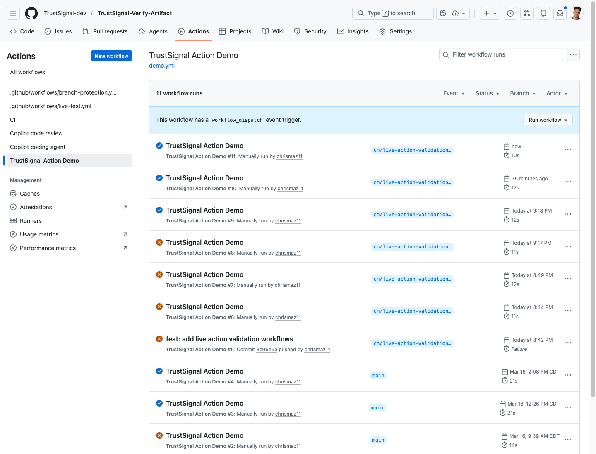
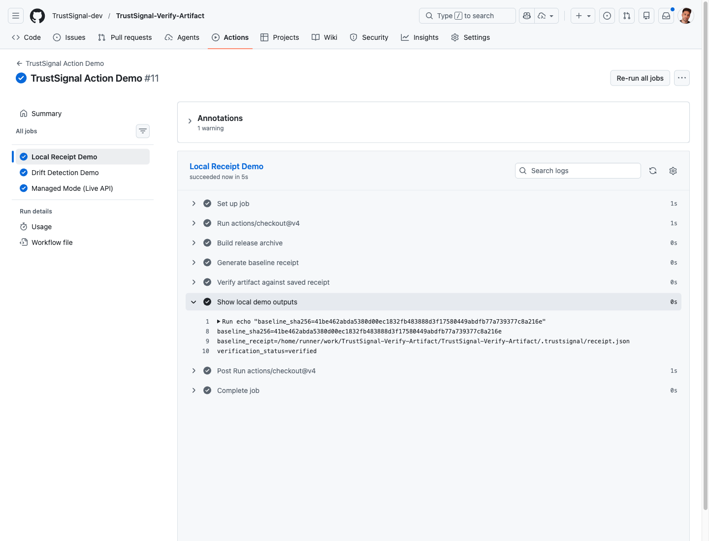
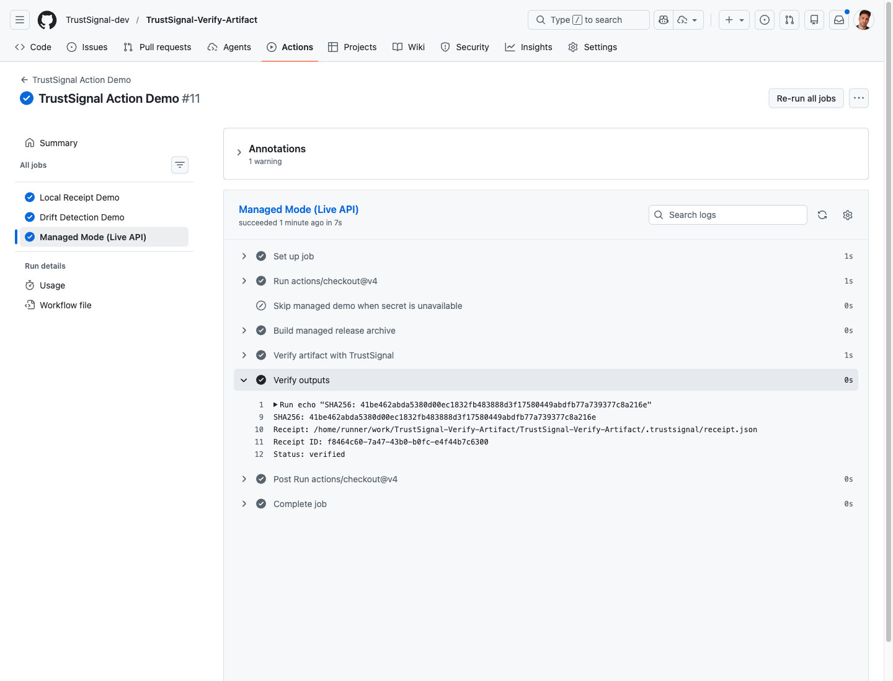

# TrustSignal Demo Walkthrough (Annotated)

This version is structured for a richer Code Hike-style presentation.

Use it when you want:

- a guided docs experience instead of a plain article
- scene-by-scene annotations around workflow YAML and API payloads
- a single page that mirrors the exact live demo order

## Scene 1: The Smallest Working Workflow

The first goal is to make the setup look simple while still using a real runner-built release archive.

```yaml
name: TrustSignal Demo

on:
  workflow_dispatch:

jobs:
  verify:
    runs-on: ubuntu-latest
    steps:
      - uses: actions/checkout@v4

      - name: Build release archive
        run: |
          mkdir -p build/release
          cp README.md build/release/README.md
          cp action.yml build/release/action.yml
          tar -czf build/trustsignal-demo-release.tgz -C build/release .

      - name: Create local receipt
        id: local
        uses: TrustSignal-dev/TrustSignal-Verify-Artifact@v0.2.0
        with:
          mode: local
          path: build/trustsignal-demo-release.tgz

      - name: Verify locally against saved receipt
        uses: TrustSignal-dev/TrustSignal-Verify-Artifact@v0.2.0
        with:
          mode: local
          path: build/trustsignal-demo-release.tgz
          receipt: ${{ steps.local.outputs.receipt_path }}

      - name: Verify with TrustSignal API
        id: managed
        uses: TrustSignal-dev/TrustSignal-Verify-Artifact@v0.2.0
        with:
          mode: managed
          path: build/trustsignal-demo-release.tgz
          api_base_url: https://api.trustsignal.dev
          api_key: ${{ secrets.TRUSTSIGNAL_API_KEY }}
```

### Annotation

- The first two action invocations prove receipt verification against a real runner-built release archive.
- The final invocation proves the live managed verification path against production.
- You only need one GitHub secret for the demo: `TRUSTSIGNAL_API_KEY`.

## Scene 2: Dispatch the Workflow

The UI moment to capture is the manual run trigger.



### Annotation

- Call out that this is a normal GitHub Actions workflow dispatch.
- Mention the branch used in the validated demo: `cm/live-action-validation-demo`.

## Scene 3: Run Summary

This scene proves the full workflow completed on a real runner, not a local mock harness.


Reference run:

- [TrustSignal Action Demo #23472323481](https://github.com/TrustSignal-dev/TrustSignal-Verify-Artifact/actions/runs/23472323481)

### Annotation

- Emphasize that the workflow is running in GitHub’s infrastructure.
- This is the point that removes the “simulated demo” objection.

## Scene 4: Local Receipt Success

Show the local job first because it is the easiest mental model.



### Annotation

- The release archive is hashed locally.
- A reusable receipt is written.
- Re-verification uses the saved receipt and does not require another API call.

## Scene 5: Drift Detection

In the recorded walkthrough, narrate this even if the screenshot focus stays on the successful local job and final managed job.

Use this explanation:

- TrustSignal is not only about issuing receipts.
- It can detect when the current release archive no longer matches the saved receipt.
- That is the gating story for release protection.

## Scene 6: Managed Verification Request

This is the live API call shape you want viewers to understand.

```json
{
  "artifact": {
    "hash": "<sha256>",
    "algorithm": "sha256"
  },
  "source": {
    "provider": "github-actions",
    "repository": "<owner/repo>",
    "workflow": "<workflow name>",
    "runId": "<run id>",
    "commit": "<git sha>",
    "actor": "<github actor>"
  },
  "metadata": {
    "artifactPath": "build/trustsignal-managed-release.tgz"
  }
}
```

### Annotation

- The action computes the release archive digest locally before the API call.
- The API receives workflow provenance context, not just a blind checksum.
- Authentication is handled with `x-api-key`.

## Scene 7: Managed Mode Passing

This is the strongest screenshot in the demo because it proves the real endpoint path is working.



### Annotation

- The managed job passed on a real GitHub-hosted runner.
- This is the live TrustSignal service, not a local test stub.
- The action returns receipt and verification metadata suitable for downstream gating.

## Scene 8: TrustSignal API Health

After the GitHub run, switch to the TrustSignal API itself.

Expected endpoints:

```text
https://api.trustsignal.dev/health
https://api.trustsignal.dev/api/v1/health
```

Expected shape:

```json
{
  "status": "ok",
  "database": {
    "ready": true,
    "initError": null
  }
}
```

### Annotation

- This closes the loop between the action and the TrustSignal service.
- The same live production service is healthy and reachable.

## Scene 9: Why This Is Different

Use one short comparison beat in the walkthrough:

- local receipts support offline re-checking
- managed mode adds a centralized TrustSignal verification layer
- drift detection gives you a practical release gate, not just a stored attestation

## Integration Notes

This page is still plain MDX, but it is organized so a docs site can upgrade it into richer Code Hike presentation with:

- progressive code annotations
- focus ranges on the YAML blocks
- side-by-side screenshots and code
- staged “scene” navigation
