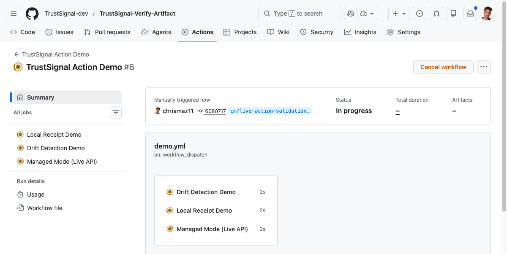

# TrustSignal Demo Walkthrough

This page is a portable MDX asset for a Code Hike-style docs site.

It walks through the full demo sequence using:

- the real `TrustSignal Verify Artifact` GitHub Action
- the live TrustSignal API at `https://api.trustsignal.dev`
- screenshots captured from a real validated run

## Demo Goal

Show three things in one flow:

1. The action can verify a real runner-built release archive.
2. The action can detect drift on a mutated release archive.
3. The action can call the live TrustSignal production API from GitHub Actions and return real verification metadata.

## Step 1: Add the Action

Start with a small workflow that builds a real release archive, runs receipt verification against it, and then calls managed mode.

```yaml
name: TrustSignal Demo

on:
  workflow_dispatch:

jobs:
  verify:
    runs-on: ubuntu-latest
    steps:
      - uses: actions/checkout@v4

      - name: Build release archive
        run: |
          mkdir -p build/release
          cp README.md build/release/README.md
          cp action.yml build/release/action.yml
          tar -czf build/trustsignal-demo-release.tgz -C build/release .

      - name: Create local receipt
        id: local
        uses: TrustSignal-dev/TrustSignal-Verify-Artifact@v0.2.0
        with:
          mode: local
          path: build/trustsignal-demo-release.tgz

      - name: Verify locally against saved receipt
        uses: TrustSignal-dev/TrustSignal-Verify-Artifact@v0.2.0
        with:
          mode: local
          path: build/trustsignal-demo-release.tgz
          receipt: ${{ steps.local.outputs.receipt_path }}

      - name: Verify with TrustSignal API
        id: managed
        uses: TrustSignal-dev/TrustSignal-Verify-Artifact@v0.2.0
        with:
          mode: managed
          path: build/trustsignal-demo-release.tgz
          api_base_url: https://api.trustsignal.dev
          api_key: ${{ secrets.TRUSTSIGNAL_API_KEY }}
```

The only required secret is:

```text
TRUSTSIGNAL_API_KEY
```

## Step 2: Run the Workflow

From the GitHub Actions UI, choose `TrustSignal Action Demo` and run it on the demo branch.


As soon as the run starts, you should see GitHub queue the jobs.



Reference run:

- [TrustSignal Action Demo #23471497658](https://github.com/TrustSignal-dev/TrustSignal-Verify-Artifact/actions/runs/23471497658)

## Step 3: Prove the Local Receipt Flow

The first job shows the simplest TrustSignal workflow:

- hash a real runner-built release archive locally
- save a receipt
- verify the same release archive against that saved receipt

This does not require a live API call for the second verification step.


## Step 4: Prove Drift Detection

The next job intentionally mutates the release archive after issuing a baseline receipt.

The key point in the demo is:

- the receipt stays the same
- the release archive changes
- verification detects the mismatch

That lets you explain that TrustSignal is not only a “sign once” system. It also supports offline re-checking later.

## Step 5: Show Managed Mode

Managed mode sends the release archive identity plus GitHub run context to TrustSignal.

Request shape:

```json
{
  "artifact": {
    "hash": "<sha256>",
    "algorithm": "sha256"
  },
  "source": {
    "provider": "github-actions",
    "repository": "<owner/repo>",
    "workflow": "<workflow name>",
    "runId": "<run id>",
    "commit": "<git sha>",
    "actor": "<github actor>"
  },
  "metadata": {
    "artifactPath": "build/trustsignal-demo-release.tgz"
  }
}
```

The API validates the request with:

```text
x-api-key: $TRUSTSIGNAL_API_KEY
```

When that succeeds, the action returns receipt and verification metadata.


## Step 6: Show the App/API Side

After the action demo, switch to the TrustSignal API surface itself and show that the same live service is healthy.

Open:

```text
https://api.trustsignal.dev/health
https://api.trustsignal.dev/api/v1/health
```

Expected response:

```json
{
  "status": "ok",
  "database": {
    "ready": true,
    "initError": null
  }
}
```

This closes the demo loop:

- GitHub Actions calls the live API
- the live API is healthy
- the verification path is not simulated

## Demo Narration

Use this short narration if you want a clean walkthrough:

1. "We start by building a real release archive in GitHub Actions."
2. "Next we generate a portable TrustSignal receipt for that archive."
3. "Then we re-verify the same archive against that saved receipt without calling the API."
4. "After that, we mutate the archive to prove drift detection."
5. "Finally, we switch to managed mode and call the live TrustSignal production API from a real GitHub-hosted runner."
6. "To close the loop, we show the live API health endpoint that the action is talking to."

## Failure Cases Worth Showing

These are useful in a product demo because they make the system feel real:

```text
403 Forbidden: invalid API key
```

- GitHub secret and backend allowlist are out of sync

```text
verification_status=invalid
```

- artifact drift or receipt mismatch

```text
400 Invalid payload
```

- authentication passed, but the caller sent a malformed request

## Notes For Site Integration

This file is intentionally plain MDX so it can be moved into:

- a Next.js docs site
- a Contentlayer/MDX docs app
- a Code Hike-compatible content pipeline

If you want richer Code Hike presentation later, the easiest upgrade is:

- replace the plain fenced blocks with Code Hike code blocks
- keep the screenshots and narrative sections unchanged
- add progressive annotations around the workflow YAML and API request JSON
